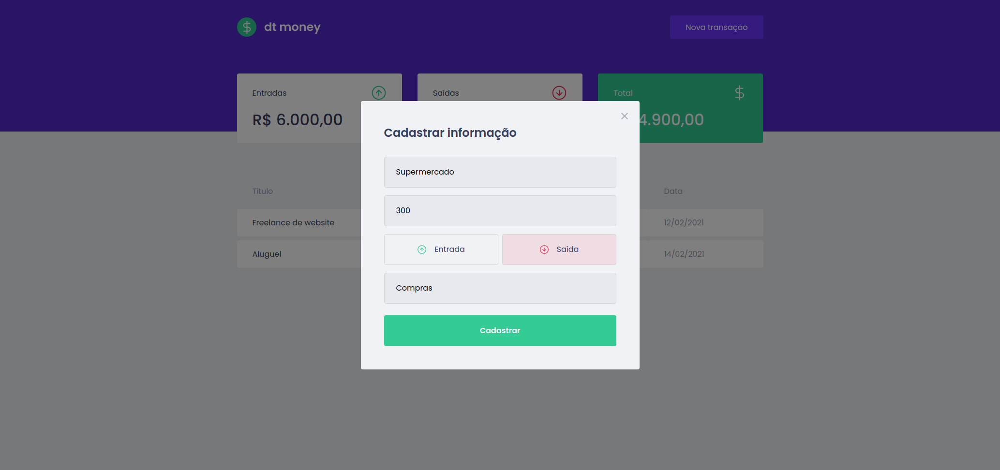
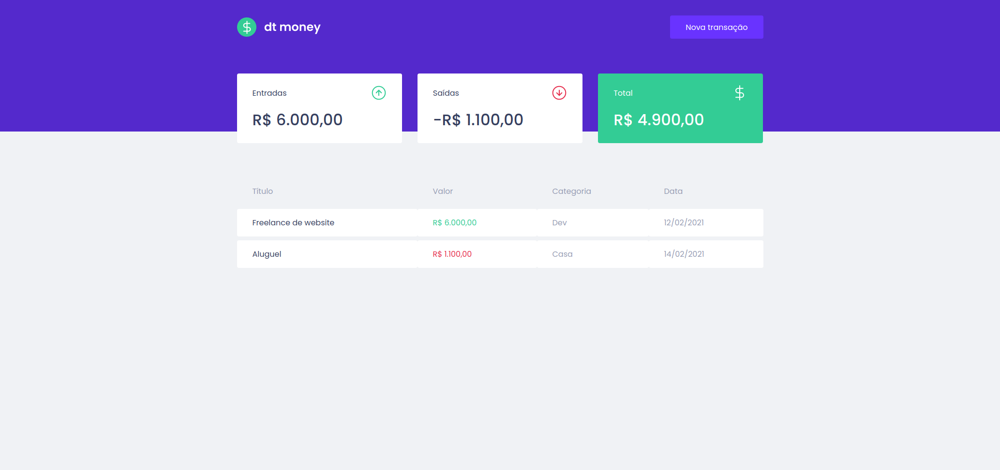

<p align="center">
   
</p>


<p align="center">
  :moneybag: Controle suas finanças. Projeto foi realizado durante treinamento do Ignite da Rocketseat. | <a href="https://github.com/Rocketseat">@Rocketseat</a>
</p>

<div align="center">
  <sub> Made with 💖 by
    <a href="https://github.com/rossignolli">Vitor Rossignolli.
  </sub>
</div>

# :camera: Screenshots
<div align="center">
   
   
</div>

# :rocket: Tecnologias
Esse projeto foi feito com as seguintes ferramentas:

* [Typescript](https://www.typescriptlang.org/)      
* [React](https://reactjs.org/)      
* [Styled Components](https://styled-components.com/)
* [MirageJS](https://miragejs.com/)

# :computer: Como rodar
```bash
# Clone este repositório
$ git clone
```

```bash
# Instale as dependecias
$ yarn

# Rode a aplicação
$ yarn start
```
Go to http://localhost:3000/ to see the result.

# :page_facing_up: License

This project is under the [MIT license](./LICENSE).
